# Full Stack Development 2 - Assignment.

__Name:__ [Damien Driver]

## Features.

+ TV Shows
+ TV Show Details 
+ Actors
+ Actor Detail
+ Upcoming Movies
+ Popular Irish Movies
+ Cast added to Movie Detail
+ Hyperlink from Cast to Actor Card 
+ Create Fantasy Movie Form
+ Pagination on Movies 
+ Protected route Favourite Movies
+ Authentication via Supabase
+ Deployment via Vercel

## Feature Design.

#### TV Shows.

> Lists TV Shows from the TV Shows endpoint of TMDB.

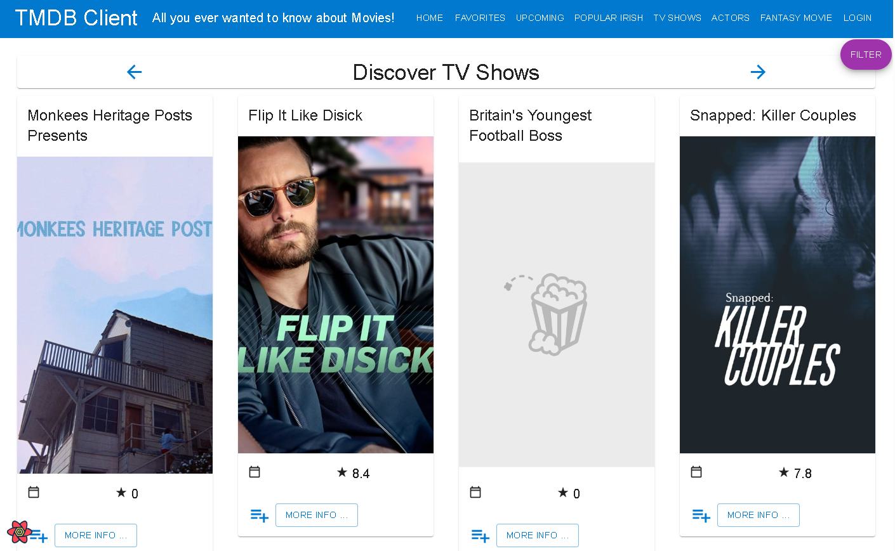

#### TV Show Details.

> Displays overview of TV Show from TV Details endpoint of TMDB.

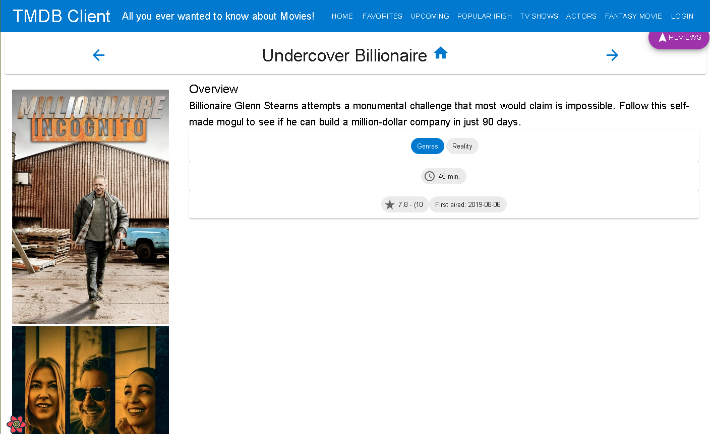

#### Actors List.

> Displays list of Actors from People endpoint of TMDB.

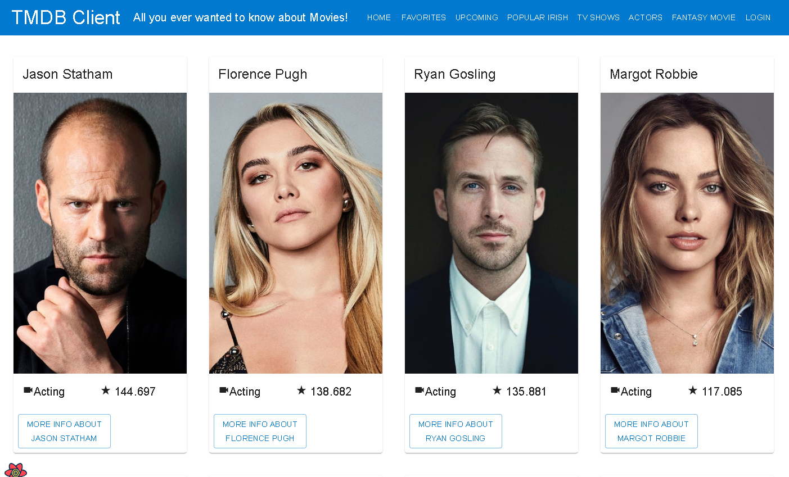

#### Actor Details.

> Displays overview of Actor from People endpoint of TMDB.

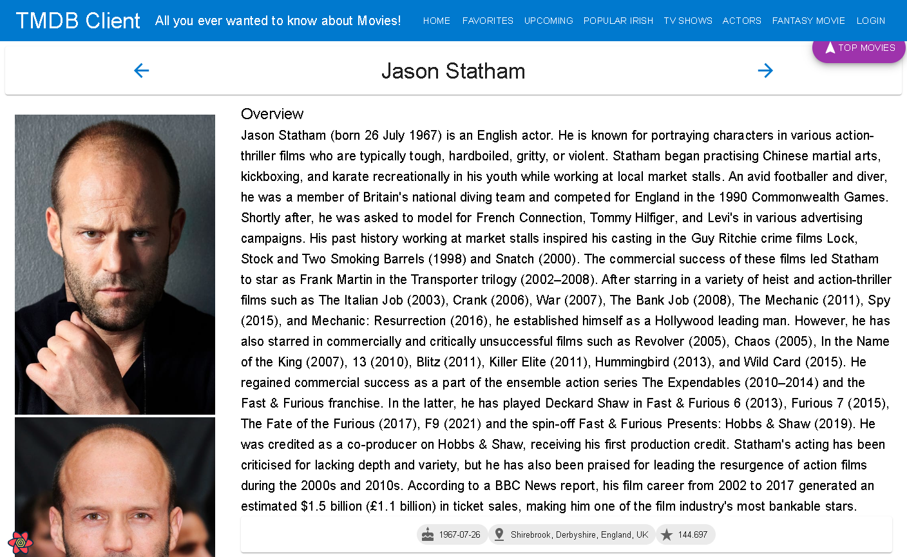

#### UpComing Movie.

> Displays list from Upcoming Movies endpoint of TMDB.

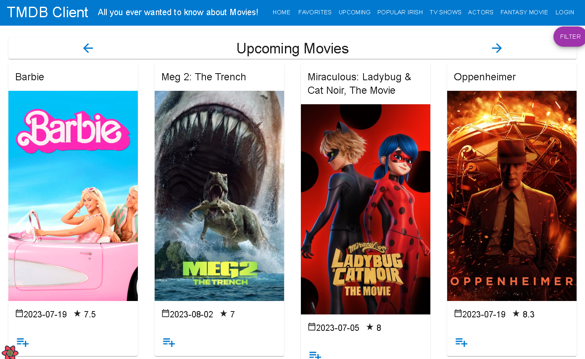

#### Popular Irish Movies.

> Displays list of Irish Movies from popular endpoint of TMDB.

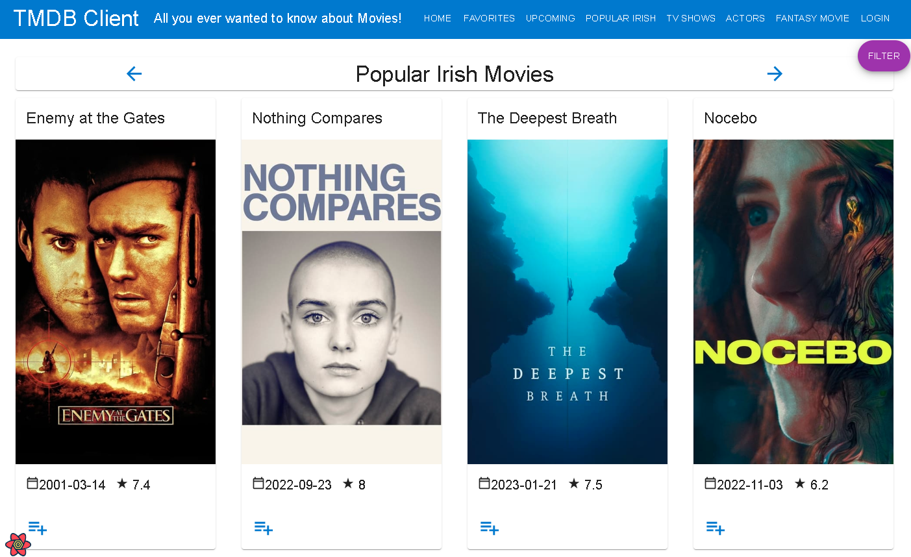

#### Cast on Movie Card.

> Displays overview of Movie with 10 Cast Members with hyperlink back to Actors card. 

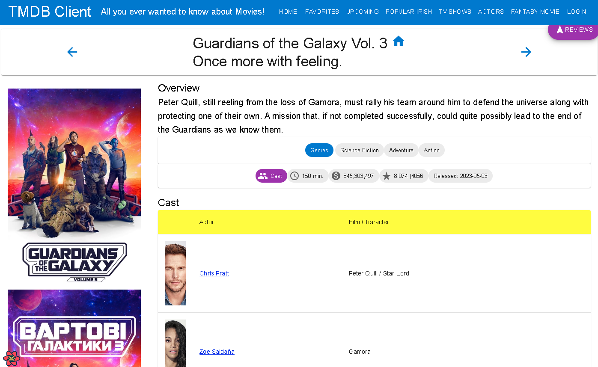

#### Fantasy Movie Form.

> Form where user can create fantasy movie details (title, genre, release date, production company, overview)

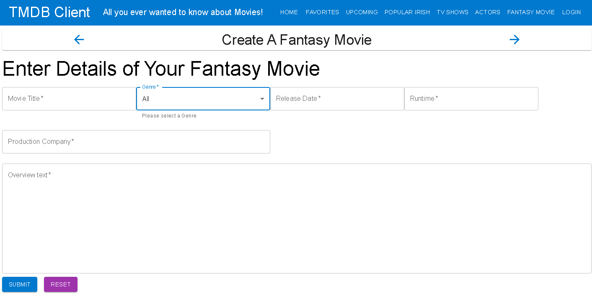

#### Pagination.

> Pagination added to Movie List Pages

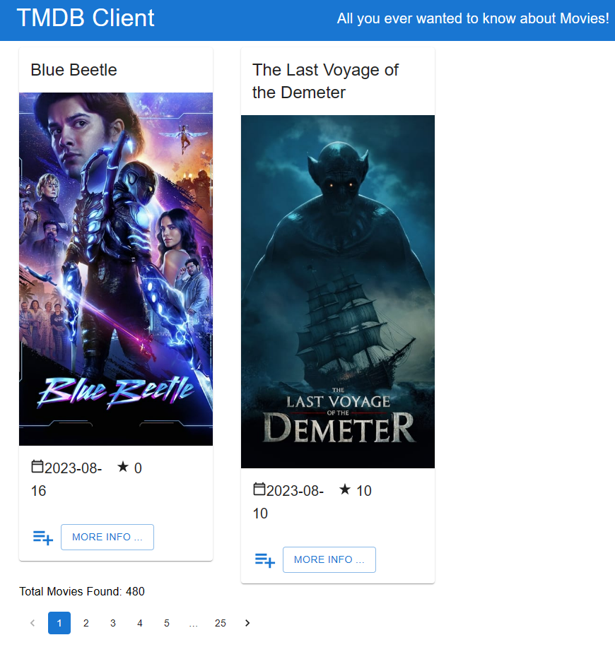

## Storybook.

> Storybook Overview with new stories.

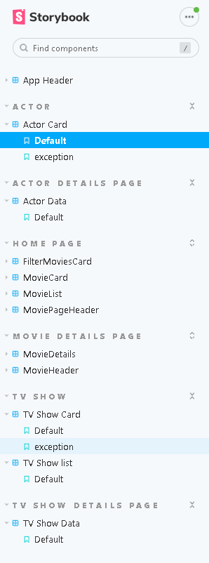

#### Storybook Actor Card.

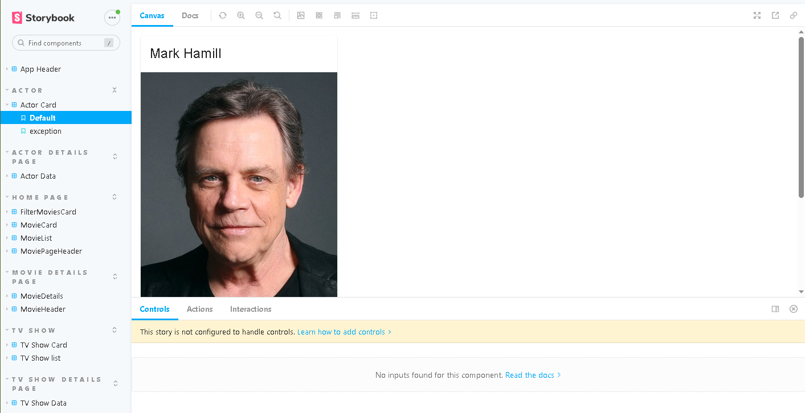

#### Storybook Actor Detail.

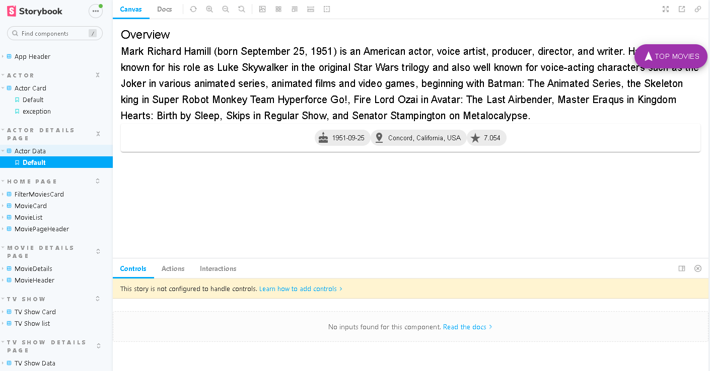

#### Storybook Movie Detail.

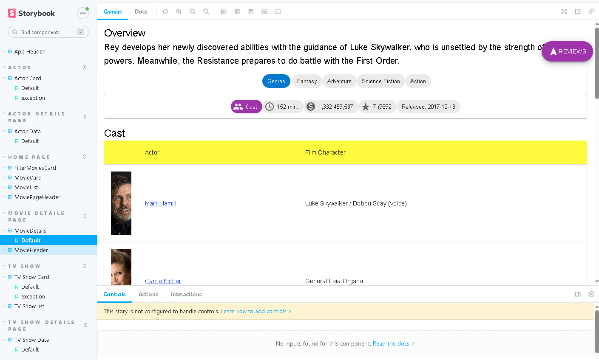

#### Storybook TV Show List.

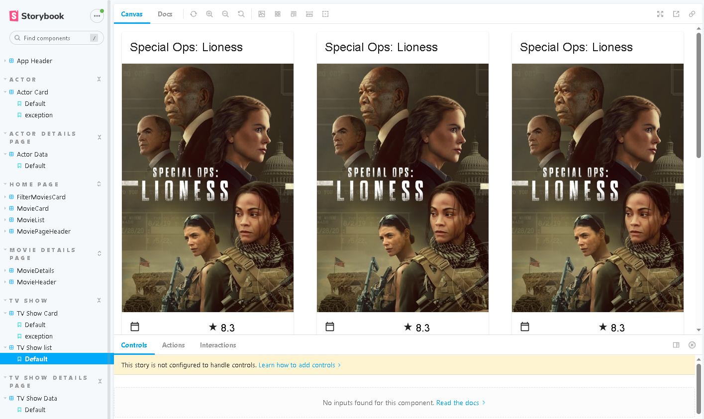

## Authentication.

Authentication added using supabase, user must login in order to access some features such as Favourite Movies and Fantasy Movie.

#### SignUp with Supabase.

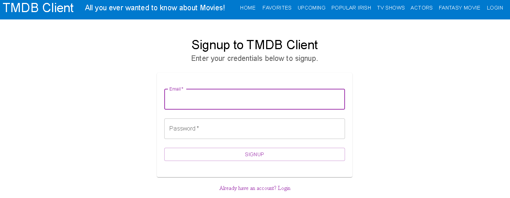

#### Login with Supabase.

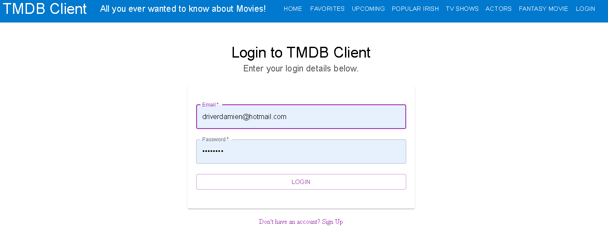

> Unprotected Pages available to all

+   / - HomePage
+   /movies/upcoming - UpcomingMoviesPage
+   /movies/:id - MoviePage
+   /reviews/:id - MovieReviewPage
+   /reviews/form - AddMovieReviewPage
+   /movies/popular - PopularMoviesPage
+   /tvShows - TVShowsPage
+   /tvShows/:id - TVShowDetailsPage
+   /actors - ActorsPage
+   /actors/:id - ActorDetailsPage
+   /login - LoginPage
+   /signup - SignupPage

> Protected Pages must be logged in to view

+   /movies/favourites - FavouriteMoviesPage
+   /movies/fantasy - AddFantasyMoviePage

+   more info button on movie list pages is hidden until login.   

#### Supabase.

> Supabase Dashboard

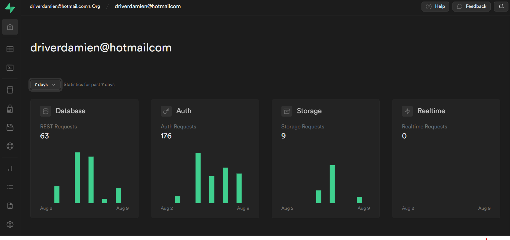

> Supabase Auth Users

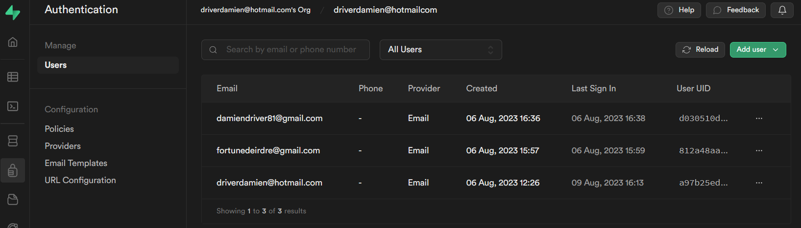

## Deployment.

> Deployed to Vercel.
+ https://lab-movies-app-bbcp.vercel.app/

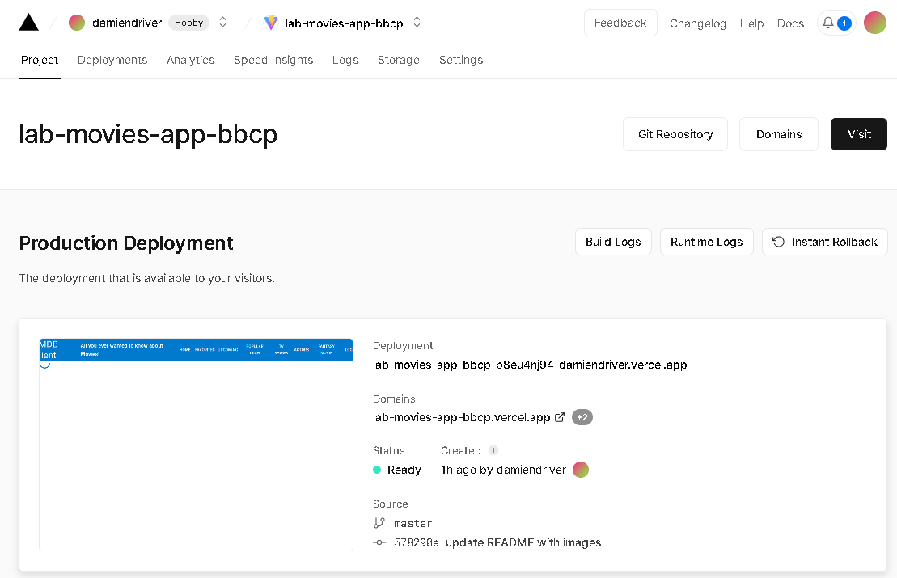

## Additional Information /  Known Issues.

+   All Pages made public as private/protected not showing when logged in.
+   After Login the siteheader is not updating to show the Logout option.
+   Fantasy Movie can be created but page was not built to display details.
+   Storybook - movieheader page is returning context error.